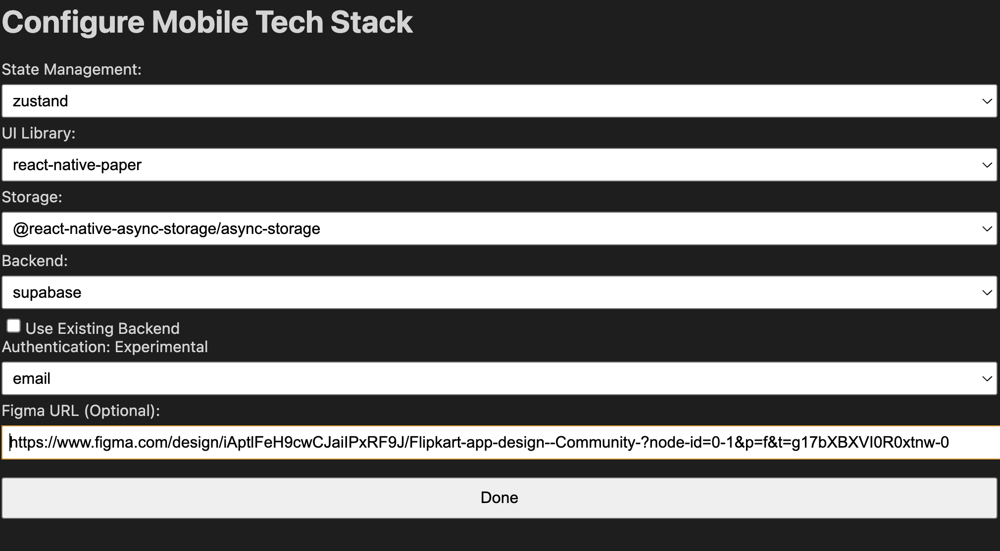
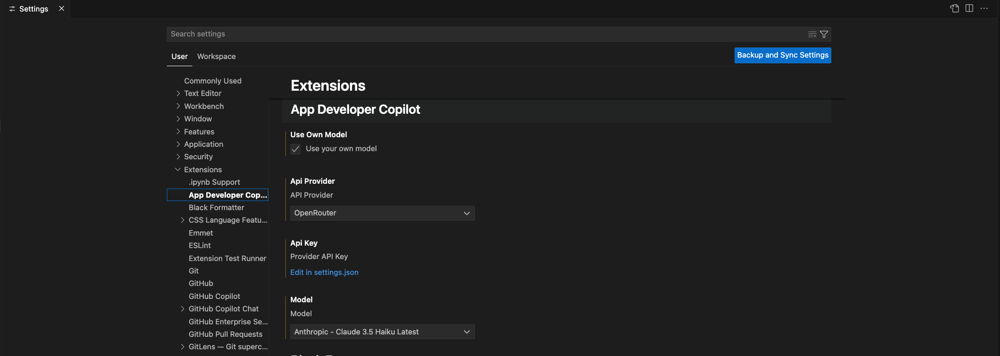

# App Developer Copilot

Generate full stack web and mobile application using your existing copilot subscription or your own key.
Note: App generarion works best with Claude 3.5 and GPT-4o models.

## Features

- Create mobile apps using React Native and Expo
- Create web apps using React and Next.js
- Option to connect to Supabase for storage and authentication
- Generate application architecture and component designs
- Automatically generate TypeScript code for components
- Handle project setup and dependency management
- Option to configure your tech stack. 

## Requirements

- Node.js v16.0.0 or higher
- Visual Studio Code 1.95.0 or higher

## Usage

### Using Copilot Chat

1. Open copilot chat window
2. Select model (Preferably 3.5 or GPT-4o)
3. Type "@app-developer-mobile" or "@app-developer-web" to start a chat with the extension
4. Use "/create" command to create a new application
5. Use "/run" command to run the generated application

### Using BYOK (Bring Your Own Key)

1. Go to extension settings and check the "Use your own model" option
2. Select API proider, model and add your key. 
3. Open the command palette by pressing `Ctrl+Shift+P` or `Cmd+Shift+P`
4. Select `App Developer: Create a mobile app` or `App Developer: Create a web app`
5. Enter prompt for the app
6. Check status bar and output console for status and logs

The extension will:

- Analyse the prompt and generate a list of features
- Create a project folder with chosen tech stack
- Generate app architecture diagram
- Generate code for components and features
- Install required dependencies
- Complete app code and ready to run

Once the app is generated, you can:

- Mobile app: Run the app using the Expo Go app on your mobile device or an emulator.
- Web app: Run the app using `npm run dev` command in the terminal for next.js apps or `npm start` for react apps.

_Please note: There might be few issues after app generation. You can manually fix them by following the error messages in the terminal. Refer Troubleshooting section for common errors_

## Chat Participants

- Mobile App Developer(`@app-developer-mobile`)
- Web App Developer(`@app-developer-web`)

### Sample Prompts

`@app-developer-mobile /create A simple notes app`

`@app-developer-mobile /create Spelling bee app to generate words for kids K-5. Generate a service using anthropic client SDK to generate words based on grade selection`

`@app-developer-mobile /create flappy bird game`

`@app-developer-web /create twitter clone`

`@app-developer-web /create blogging platform`

## Commands

- `create` - Create a new mobile application
- `run` - Run the generated application

## Extension Development

Built with:

- TypeScript
- VS Code Extension API
- Webpack for bundling
- Jest for testing

## Issues & Suggestions

Please feel free to open issues and suggest features or pull requests on [Github](https://github.com/sindujaramaraj/app-developer-copilot).

## TROUBLESHOOTING

### Common Errors After App Generation

- Typescript errors: Check the generated code for any TypeScript errors and fix them as needed.
- Missing dependencies: Ensure that all required dependencies are installed. You can check the package.json file for any missing packages.
- Using deprecated libraries: Ensure that you are using the latest version of the libraries. You can check the package.json file for any outdated packages and update imports accordingly.
